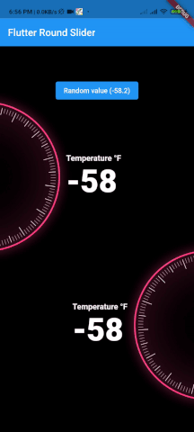

# Flutter Round Slider / Circular Slider

A Flutter package to create a Round Slider. It also supports you can create your own style. It will be useful for your awesome app. 

More from [Romantic Developer](https://pub.dev/publishers/romanticdeveloper.com/packages)



### Example

```dart
import 'dart:math';

import 'package:flutter/material.dart';
import 'package:flutter_round_slider/flutter_round_slider.dart';

void main() {
  runApp(MyApp());
}

class MyApp extends StatelessWidget {
  @override
  Widget build(BuildContext context) {
    return MaterialApp(
      title: 'Flutter Demo',
      theme: ThemeData(
        primarySwatch: Colors.blue,
      ),
      home: HomePage(),
    );
  }
}

class HomePage extends StatefulWidget {
  @override
  _HomePageState createState() => _HomePageState();
}

class _HomePageState extends State<HomePage> {
  double value = 0;
  final valueTween = Tween<double>(begin: -120, end: 120);
  @override
  Widget build(BuildContext context) {
    return Scaffold(
      backgroundColor: Colors.black,
      appBar: AppBar(
        title: Text('Flutter Round Slider'),
      ),
      body: Column(
        mainAxisAlignment: MainAxisAlignment.center,
        children: [
          ElevatedButton(
              onPressed: () {
                setState(() {
                  value = Random.secure().nextDouble();
                });
              },
              child: Text(
                  'Random value (${valueTween.transform(value).toStringAsFixed(1)})')),
          Row(
            children: [
              RoundSlider(
                style: RoundSliderStyle(
                  alignment: RoundSliderAlignment.left,
                ),
                value: value,
                onChanged: (double value) {
                  setState(() {
                    this.value = value;
                  });
                },
              ),
              Padding(
                padding: const EdgeInsets.only(left: 14.0),
                child: Column(
                  crossAxisAlignment: CrossAxisAlignment.start,
                  children: [
                    Text(
                      'Temperature °F',
                      style: TextStyle(
                        fontSize: 16,
                        color: Colors.white,
                        fontWeight: FontWeight.bold,
                      ),
                    ),
                    Text(
                      '${valueTween.transform(value).round()}',
                      style: TextStyle(
                        fontSize: 64,
                        color: Colors.white,
                        fontWeight: FontWeight.w900,
                      ),
                    ),
                  ],
                ),
              ),
            ],
          ),
          Row(
            mainAxisAlignment: MainAxisAlignment.end,
            children: [
              Padding(
                padding: const EdgeInsets.only(right: 14.0),
                child: Column(
                  crossAxisAlignment: CrossAxisAlignment.start,
                  children: [
                    Text(
                      'Temperature °F',
                      style: TextStyle(
                        fontSize: 16,
                        color: Colors.white,
                        fontWeight: FontWeight.bold,
                      ),
                    ),
                    Text(
                      '${valueTween.transform(value).round()}',
                      style: TextStyle(
                        fontSize: 64,
                        color: Colors.white,
                        fontWeight: FontWeight.w900,
                      ),
                    ),
                  ],
                ),
              ),
              RoundSlider(
                style: RoundSliderStyle(
                  alignment: RoundSliderAlignment.right,
                ),
                value: value,
                onChanged: (double value) {
                  setState(() {
                    this.value = value;
                  });
                },
              ),
            ],
          ),
        ],
      ),
    );
  }
}
```

### Development environment

```
[✓] Flutter (Channel stable, 2.0.5, on macOS 11.2.3 20D91 darwin-x64, locale en-VN)
    • Flutter version 2.0.5
    • Framework revision adc687823a (11 days ago), 2021-04-16 09:40:20 -0700
    • Engine revision b09f014e96
    • Dart version 2.12.3

[✓] Android toolchain - develop for Android devices (Android SDK version 30.0.3)
    • Platform android-30, build-tools 30.0.3
    • Java binary at: /Applications/Android Studio.app/Contents/jre/jdk/Contents/Home/bin/java
    • Java version OpenJDK Runtime Environment (build 1.8.0_242-release-1644-b3-6915495)
    • All Android licenses accepted.

[✓] Xcode - develop for iOS and macOS
    • Xcode at /Applications/Xcode_12.app/Contents/Developer
    • Xcode 12.4, Build version 12D4e
    • CocoaPods version 1.10.1

[✓] Chrome - develop for the web
    • Chrome at /Applications/Google Chrome.app/Contents/MacOS/Google Chrome

[✓] Android Studio (version 4.1)
    • Android Studio at /Applications/Android Studio.app/Contents
    • Flutter plugin can be installed from:
      🔨 https://plugins.jetbrains.com/plugin/9212-flutter
    • Dart plugin can be installed from:
      🔨 https://plugins.jetbrains.com/plugin/6351-dart
    • Java version OpenJDK Runtime Environment (build 1.8.0_242-release-1644-b3-6915495)
```